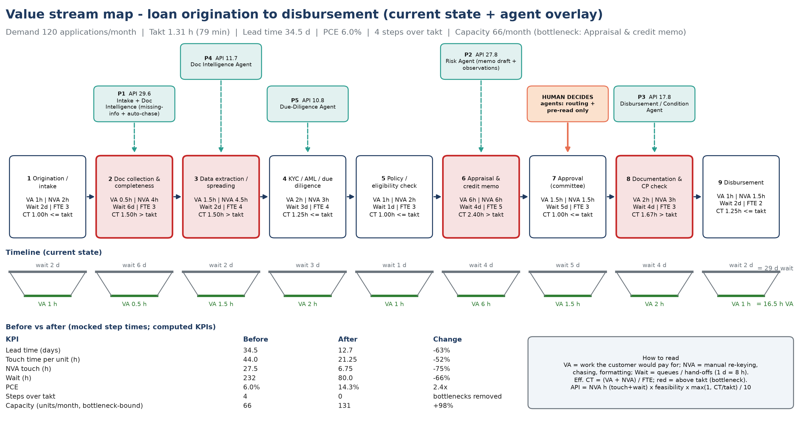
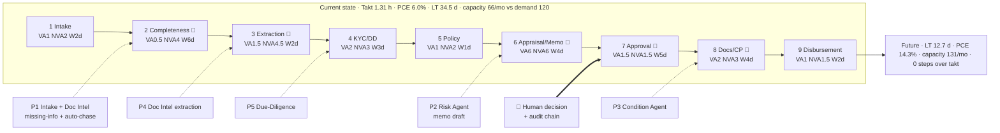

# Assignment 1: Agentic Loan Lifecycle Management

```bash
streamlit run a1_loan_lifecycle/app.py
```

## What the prototype does

Loan application → ingest supporting documents → extract information → identify missing information → policy and eligibility checks → risk observations → recommended next action → **human approval** → **auditable decision summary**.

| Tab | Shows |
|---|---|
| ⓪ Value stream | Lean VSM: VA / NVA / wait per step, takt time, PCE, bottlenecks, Automation Priority Index, before vs after. Demand and hours are editable. |
| ① Origination → Decision | Agent pipeline with timings, evidence-backed extraction, missing-info email draft, RAG-cited policy checks, risk grade, recommendation, credit memo, human gate and downloadable decision summary |
| ② Disbursement CPs | Condition-precedent checklist that blocks release until every CP is evidenced |
| ③ Portfolio monitoring | Covenant and early-warning (EWS) scan over 10 synthetic loans, with notes on Red accounts |
| ④ Audit & observability | Hash-chain validity, audit events, LLM telemetry (mode, latency, tokens) |

### Demo cases (synthetic)

| Case | Facility | Expected agent outcome |
|---|---|---|
| APP-1001 Greenfield Logistics | $4.0M term loan | All checks pass (DSCR 1.97x, LTV 53%) → **APPROVE**, Senior Credit Officer |
| APP-1002 Sunrise Agro Foods | $1.5M working capital | Missing bank statement, stock statement, BO declaration, audited FS → **REQUEST INFO** + draft email |
| APP-1003 Meridian Infra SPV | $28M project finance | DSCR 0.59x, leverage 10.2x, LTV 93%, PEP, adverse media, stale valuation, **prompt-injection text in a document** → **DECLINE**, Board Credit Committee |

Controls to try: approving above your role's authority is blocked, and overriding the agent without a rationale is blocked.

## Agents

| Agent | File | Role |
|---|---|---|
| Intake | `agents/intake.py` | Normalises the application, classifies the segment, inventories documents, screens for prompt injection |
| Document Intelligence | `agents/doc_intel.py` | LLM extraction with confidence and evidence. Each value is grounded against the source (regex fallback in mock mode). |
| Due-Diligence | `agents/due_diligence.py` | Missing docs and fields + drafted request; deterministic ratios (DSCR, stressed DSCR, leverage, LTV, vintage); policy checks cited to clauses |
| Risk | `agents/risk.py` | Transparent scorecard grade 1–10 + observations and mitigants (no protected attributes) |
| Approval / Workflow | `agents/approval.py` | Recommendation, authority routing (CP-6.1), conditions precedent, draft credit memo |
| Disbursement / CP | `agents/disbursement.py` | Gates disbursement until every CP is evidenced |
| Portfolio Monitoring | `agents/portfolio.py` | Quarterly covenant and EWS rules (CP-8.1) |

The orchestrator (`orchestrator.py`) is an explicit state machine that times each step and writes it to the audit log. Its nodes map one-to-one onto LangGraph, Azure AI Foundry Agent Service or Durable Functions in production. RAG uses TF-IDF over `knowledge/credit_policy.md` in the prototype; Azure AI Search replaces it in production.

## Value stream map (current state + agent overlay)





**Formulas:** Takt = available time ÷ demand. Effective CT = (VA + NVA) ÷ FTE. PCE = VA ÷ lead time. Automation Priority Index = NVA hours (touch + wait) × feasibility (1–5) × max(1, CT ÷ takt) ÷ 10.

## Assumptions

- **Synthetic data:** applications, documents, credit policy (CP-x clauses), portfolio and KYC results are all synthetic.
- **VSM inputs:** step times, FTEs and feasibility scores are mocked in `data/vsm_steps.csv`. Demand is 120 applications/month, available time is 21 days × 7.5 h, and 1 wait-day = 8 h.
- **Value:** the value estimate uses $60/h loaded analyst cost.
- **SLA:** SLA adherence (~30% → ~90%) assumes a 21-day SLA and a typical lead-time spread.
- **LLM modes:** in mock mode the LLM outputs are deterministic templates built from the same facts. In Azure mode the prompts are in each agent.
