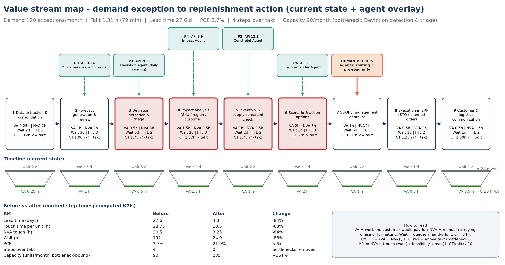
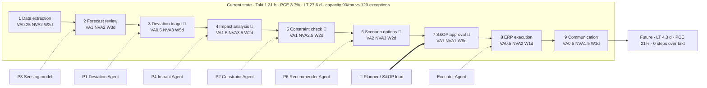

# Assignment 2: AI for Demand & Distribution (chemical manufacturer)

```bash
streamlit run a2_chem_demand/app.py
```

## Opportunity map (7 use cases)

Full cards are in `data/opportunities.csv` and app tab ⓪. Each card covers problem → AI/agent approach → data → action → human involvement → KPI → benefit.

| ID | Use case | Value | Feasibility | Wave |
|---|---|---|---|---|
| UC1 | **Demand sensing + agentic response** (prototyped) | 5 | 4 | 1 |
| UC2 | Stockout / excess inventory prediction | 4 | 4 | 1 |
| UC3 | Inventory optimisation (multi-echelon safety stock) | 5 | 3 | 2 |
| UC4 | Shipment exception management | 3 | 4 | 2 |
| UC7 | Invoice / AP automation | 2 | 5 | 2 |
| UC5 | Distribution / lane optimisation | 4 | 3 | 3 |
| UC6 | Supply / feedstock disruption prediction | 4 | 2 | 3 |

UC1 comes first because it scores highest on value × feasibility. It also removes the #1 VSM bottleneck (deviation detection, API 28.6), and its data foundation feeds UC2 and UC3.

## Prototype flow

Historical orders + inventory + production capacity + external signals → **demand sensing** → **Deviation Agent** flags significant gaps → **Impact Agent** finds the affected SKU, region and customers → **Constraint Agent** checks inventory, safety stock, plant capacity and lanes → **Recommender Agent** builds the least-cost plan → **planner / S&OP lead approves** (and may edit) → **Executor Agent** creates SAP STO / planned order / IBP update (mocked) and sends notifications.

| Tab | Shows |
|---|---|
| ⓪ Opportunity map | Cards + value × feasibility matrix |
| ① Value stream | VSM of the demand-exception process: takt, PCE, bottlenecks, priority index |
| ② Demand sensing | Backtest WMAPE (sensing vs 13-week MA vs frozen S&OP plan) and per-series chart |
| ③ Agentic response | Alerts → impact → constraints → options → editable plan → approval → triggered transactions |
| ④ Audit & observability | Hash-chained events, LLM telemetry |

**Model.** `forecasting.py` trains a global gradient-boosting model that forecasts the next 4 weeks. Its features are scaled lags, seasonality, regional PMI and its 4-week change, Brent and a construction index. The forecast is blended 50/50 with the 4-week run-rate (short-term sensing). The backtest covers 16 weekly origins and trains strictly on earlier data. On synthetic data, WMAPE is about 8.5% for sensing vs 13.5% for the frozen S&OP plan.

**Approval rules.** Plans costing over $50k need the S&OP Lead. Editing or rejecting a plan needs a rationale. The LLM never sets quantities or costs.

### Injected demo events (synthetic)

1. **EPX-200 epoxy resin, APAC:** Pacific Coatings ramps up a project (+50% to +130%) while APAC PMI rises. Sensed demand is +36% (actuals +69%), leaving a 752 t gap at DC-Singapore. The plan combines a Rotterdam transfer, a Jurong pull-forward, an expedite and an allocation, and is routed to the S&OP Lead.
2. **PVC-K67, EU:** Iberia Polymers has an outage (−86%) and the EU market softens. The deviation is −17%, and the plan re-deploys excess Rotterdam stock to Houston.

## Value stream map (current state + agent overlay)





## Synthetic data and assumptions

- **Orders and signals:** `data/generate_synthetic.py` (seed 42) generates 104 weeks × 12 SKUs × 4 regions (NAM, EU, APAC, LATAM) × 3 customers per region, plus weekly PMI per region, Brent and a construction index.
- **Supply side:** inventory by DC, plant capacity and planned volumes, reschedule premiums, and inter-DC lanes with sea and expedite cost and time.
- **Margins:** prices and margins per tonne are illustrative.
- **VSM inputs:** step times are mocked in `data/vsm_steps.csv`, with 120 significant demand exceptions/month.
- **Benefits:** stated as ranges for a ~$5B-revenue manufacturer, to be validated against the client's SAP history in POC weeks 1–2.
- **SAP / IBP calls:** these are mock payloads (`runtime/sap_outbox.jsonl`). In production they become BAPI/OData calls through SAP BTP.
